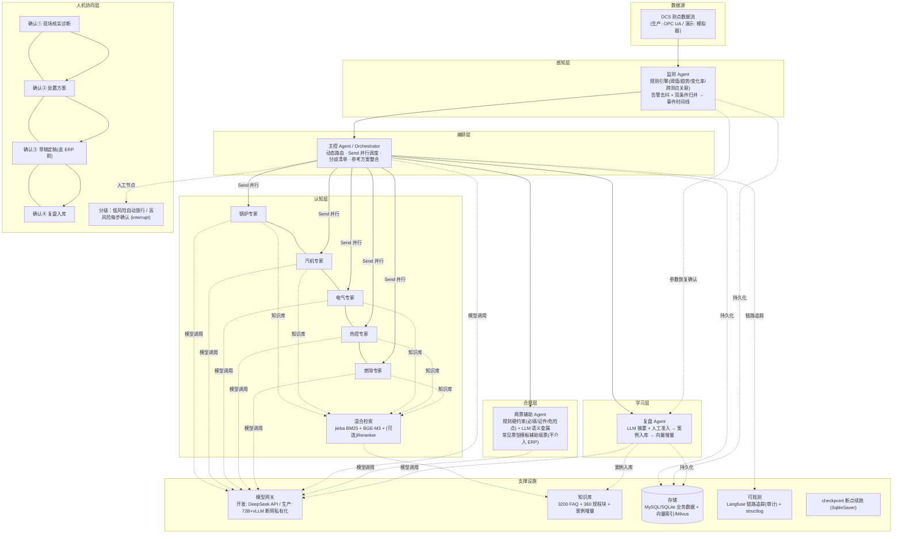

# 火电两票协同智能审查与设备运维多 Agent 系统 — 架构图

> 版本：v1.0（2026-08-12） | 对应代码：backend/agents、backend/graphs

## 1. 总体架构（分层视图）

## 2. 组件职责与边界

| 组件 | 职责 | 边界（红线） |
|---|---|---|
| 监测 Agent | 24h 常驻感知、趋势预警、告警归并 | 趋势预警不触发诊断；LLM 仅越限/组合异常唤醒 |
| 班组专家×5 | 并行检索知识库、输出诊断意见（原因/验证/影响/置信度/来源） | 只出研判素材，不做结论 |
| 主控 Agent | 动态路由、整合意见、梳理分歧清单、生成参考方案 | 只整合不裁定；分歧交人工裁决 |
| 两票辅助 | 填票防错检查、常见票型草稿辅助 | 不提交、不签发、不介入 ERP 流程 |
| 复盘 Agent | 生成复盘摘要、人工准入后入库、触发向量增量 | 未人工批准不写入知识库 |
| 人工确认×4 | 分级确认（interrupt 挂起/恢复） | 无 AI 决策；最终结论由人决定 |

## 3. 关键机制

1. 事件驱动：监测 Agent 常驻消费测点流，异常事件触发诊断实例（thread_id = event_id）
2. 并行协同：Send API 动态 fan-out 唤醒相关班组（只激活 1-2 个，省算力）
3. 人机协同：interrupt 挂起 → 人工处理 → Command(resume) 恢复；checkpoint 断点续跑
4. 幂等：event_id 作为 TraceID，检索/入库查重，重复执行复用结果
5. 知识闭环：复盘人工确认 → 入库 → load_kb 加载案例为知识 → 检索匹配度提升 → 缓存一致性自检
6. 模型无关：模型网关双模式（DeepSeek API / vLLM 72B），改配置切换，数据不出域

## 4. 部署形态

1. 单机一体化（演示/班组级）：编排 + 检索 + 数据库 + Web 界面同机；LLM 推理走网关外部
2. 生产拆分：vLLM GPU 推理服务器独立；Milvus/MySQL 独立服务；DCS 数据经 OPC UA 接入
