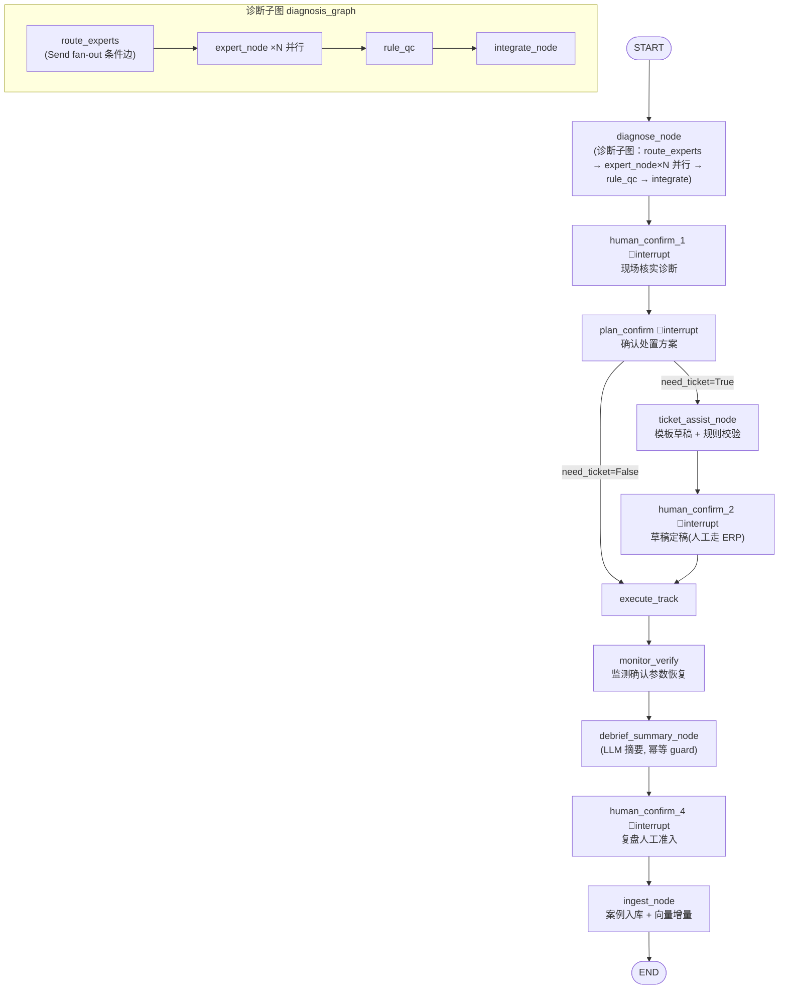
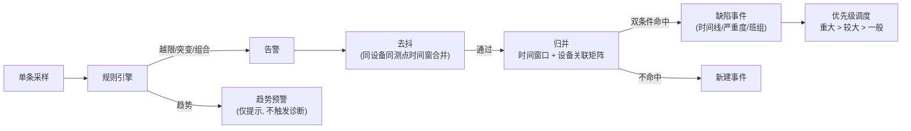
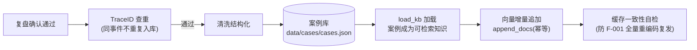

# 火电两票协同智能审查与设备运维多 Agent 系统 — 项目流程图

> 版本：v1.0（2026-08-12） | 对应代码：backend/graphs/diagnosis_graph.py + workflow_graph.py

## 1. 业务闭环总流程

```mermaid
flowchart LR
    A["监测 Agent<br/>测点流 → 规则检测"] -->|异常| B["告警归并<br/>去抖 + 时间/设备关联双条件<br/>→ 缺陷事件(事件时间线)"]
    B --> C["主控路由<br/>按设备归属激活班组专家"]
    C --> D["班组专家并行会诊<br/>(Send fan-out, 1-2 个)"]
    D --> E["规则质检<br/>来源引用/三要素/置信度"]
    E --> F["主控整合<br/>研判素材 + 分歧清单 + 参考方案"]
    F -->|interrupt| G["人工确认①<br/>现场核实诊断"]
    G -->|resume| H["人工确认②<br/>确认处置方案"]
    H -->|需检修| I["两票辅助<br/>模板草稿 + 规则校验"]
    I -->|interrupt| J["人工确认③<br/>草稿定稿 → 人工走 ERP 开票"]
    H -->|不需检修| K["执行跟踪"]
    J --> K
    K --> L["监测恢复确认<br/>参数回归正常"]
    L --> M["复盘摘要(LLM)<br/>建议原因/方案/结果"]
    M -->|interrupt| N["人工确认④<br/>复盘准入"]
    N -->|批准| O["案例入库<br/>向量增量 → 知识闭环"]
    N -->|驳回| P["案例丢弃/待修正"]
```

## 2. LangGraph 图结构（节点 + 分支 + 中断）

关键机制标注：
1. 🔴 = interrupt 人工节点（挂起 → 人工处理 → Command(resume) 恢复）
2. thread_id = event_id（TraceID，断点续跑与幂等的基础）
3. 幂等 guard：已有 output/摘要则跳过 LLM（断点恢复/测试注入）

## 3. 告警归并子流程（监测 Agent 内）

## 4. 人工确认分级策略

| 级别 | 场景 | 行为 |
|---|---|---|
| 低风险（一般） | 普通缺陷 | 自动放行（规则判定跳过 interrupt） |
| 中风险（较大） | 关键设备 | 关键节点 interrupt |
| 高风险（重大） | 动火/受限空间/重大设备 | 每步 interrupt，强制人工 |

## 5. 知识闭环子流程

